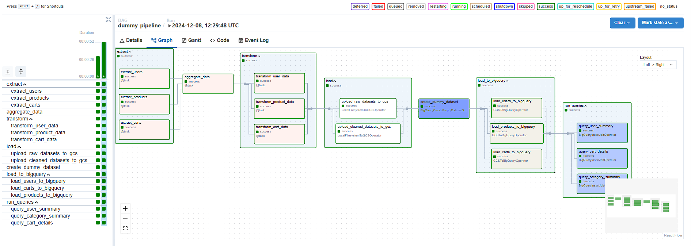

# ETL Pipeline Documentation

## Overview

This documentation provides an explanation of the ETL pipeline that extracts data from the dummyJSON API, transforms and cleans it, and then loads it into Google BigQuery.

## Pipeline Design

### DAG Structure

The DAG is defined using Apache Airflow’s `@dag` and `@task` decorators. The pipeline is logically separated into task groups that represent distinct stages of the ETL process:

1. **Extract**: Fetch data from multiple API endpoints.
2. **Aggregate**: Combine API responses into a single unified dictionary.
3. **Transform**: Clean and validate the extracted data using Pydantic schemas.
4. **Load to GCS**: Uploads both raw and cleaned datasets to Google Cloud Storage.
5. **Create BigQuery Dataset**: Creates an empty dataset in BigQuery if it doesn't exist.
6. **Load to BigQuery**: Ingests the cleaned data from GCS into BigQuery tables.
7. **Run Queries**: Executes SQL queries on the BigQuery tables to generate summarized outputs.

**DAG Dependencies:**


- **`extract()`**: Extract tasks run in parallel for each endpoint (`users`, `products`, `carts`).
- **`aggregate_data`**: Gathers all extracted data into one result.
- **`transform()`**: Cleans and transforms extracted data using defined schemas.
- **`load()`**: Moves raw and cleaned JSON files from local storage to GCS.
- **`create_dummy_dataset`**: Ensures BigQuery dataset `dummyjson` is present.
- **`load_data()`**: Loads cleaned data from GCS to BigQuery tables (`users`, `products`, and `carts`).
- **`run_queries()`**: Runs summary queries against the loaded BigQuery tables.

### Task Groups

- **Extract** (`extract`): Fetches data from `users`, `products`, and `carts` endpoints, writing raw JSON files locally.
- **Transform** (`transform`): Cleans data using Pydantic schemas:
  - `transform_user_data()`: Applies `UserSchema` and flattens address fields.
  - `transform_product_data()`: Applies `ProductSchema` and filters products by price.
  - `transform_cart_data()`: Applies `CartSchema` and flattens cart items.
- **Load** (`load`): Copies raw and cleaned data from local storage to GCS.
- **Load to BigQuery** (`load_data`): Loads cleaned JSON files from GCS into BigQuery tables using autodetect schema.
- **Run Queries** (`run_queries`): Executes SQL queries to produce summarized tables.

### Schemas and Validation

- **`schemas/users.py`**: Defines `UserSchema`. Flattens nested address fields and ensures proper data mapping.
- **`schemas/products.py`**: Defines `ProductSchema`. Filters out products priced below 50 units and ensures consistent field naming.
- **`schemas/carts.py`**: Defines `CartSchema` and `CartProductSchema`. Normalizes cart data and expands cart line items into a flat structure.

### Scripts and Helpers

- **`scripts/bg_sql_scripts.py`**: Contains SQL queries for summarizing data in BigQuery.
- **`scripts/helpers.py`**: Provides helper functions for:
  - Fetching data from the API (`fetch_api_data()`).
  - Saving cleaned data to JSON (`save_to_json()`).
  - Loading data to GCS and BigQuery (`load_to_gcs()`, `load_to_bigquery()`).
  - Running BigQuery queries (`run_big_query_queries()`).

## BigQuery Queries

Three main queries are defined:

1. **User Summary (`USER_SUMMARY_QUERY`)**:

   ```sql
   SELECT
     u.user_id,
     u.first_name,
     u.age,
     u.city,
     SUM(c.quantity) AS total_items,
     ROUND(SUM(c.total_cart_value), 2) AS total_spent
   FROM `dummyjson.users` u
   INNER JOIN `dummyjson.carts` c
   ON u.user_id = c.user_id
   GROUP BY u.user_id, u.first_name, u.age, u.city
   ORDER BY total_spent DESC
   ```

Purpose: Aggregates user-level spending and item counts.

2. **Category Summary (`CATEGORY_SUMMARY_QUERY`)**:

   ```sql
   SELECT
    p.category,
    ROUND(SUM(c.total_cart_value), 2) AS total_sales,
    SUM(c.quantity) AS total_items_sold
   FROM `dummyjson.carts` c
   INNER JOIN `dummyjson.products` p
   ON p.product_id = c.product_id
   GROUP BY category
   ORDER BY total_sales
    ```

Purpose: Summarizes sales by product category.

3. **Cart Details (`CART_DETAILS_QUERY`)**:

    ```sql
    SELECT cart_id, user_id, product_id, quantity, price, total_cart_value 
    FROM `dummyjson.carts`
    ```

Purpose: Provides a simple table of cart line items for further analysis.

## Assumptions and Trade-offs

### Assumptions

- use of Task Groups to logically separate stages of the ETL process.
- data consistency and quality are ensured by Pydantic schemas.
- BigQuery tables are created with autodetect schema for simplicity.

### Trade-offs

- use of auto-generated schema in BigQuery may lead to potential data type mismatches.
- limited error handling and retries in the pipeline for simplicity.
- machine has enough resources to handle parallel tasks(number of cores).
